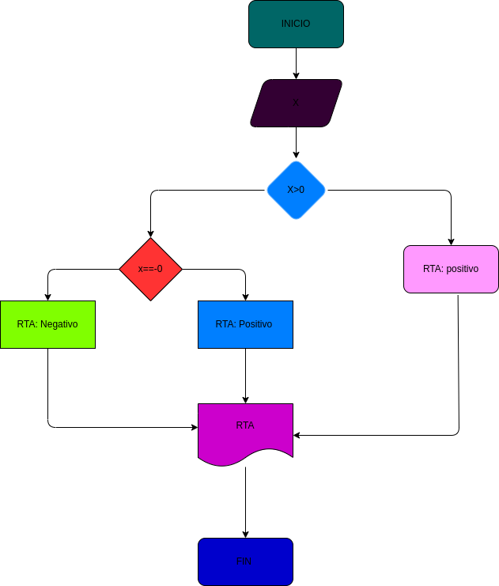

# Ejercicio N.5

## verificar si un numero es Falso o Verdadero

# Analisis

variable de entrada (imput)

X: numero a verificar

variable del proceso y salida (prosessing, storange, output)

rta: resultado de la verificacion numero es falso o verdadero 

# DISEÑO

# CONSTRUCCION
